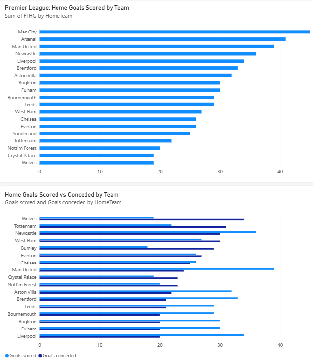

# Premier League 2025/26 Match Analysis

Analysis of all 380 Premier League 2025/26 matches using Power BI, Python and SQL (dbt). Data source: football-data.co.uk.

## Questions answered
- Which teams score the most goals at home?
- How big is home advantage?
- Which teams are strongest, and weakest, at home?
- Can the full league table be rebuilt from raw match results?

## Key findings
- Home teams won 42.6% of matches, away teams won 30.0%, and 27.4% were draws.
- Home sides averaged about 1.53 goals per match, against 1.22 for away sides.
- Man City scored the most home goals (about 45), while Burnley scored the fewest (about 18).
- Newcastle had the biggest home/away goal gap, scoring 36 at home and 17 away.
- A league table rebuilt from the match results matches the official 2025/26 final standings (Arsenal first on 85 points).

## Dashboard

## Python analysis
The notebook `premier_league_2025_26_analysis.ipynb` uses pandas and matplotlib to calculate home, draw and away results, compare home and away goals by team, and rebuild the full league table.

## dbt project
The `football_dbt` folder rebuilds the league table with dbt and DuckDB:
- `stg_matches`: cleans the raw CSV and sets data types
- `team_matches`: reshapes matches into one row per team per match
- `league_table` and `home_away_summary`: final tables
- 9 data tests, including a check that the season has exactly 380 matches

To run it: `pip install dbt-duckdb`, then run `dbt run --profiles-dir .` and `dbt test --profiles-dir .` inside the `football_dbt` folder.

## Tools
- Power BI Desktop
- Python (pandas, matplotlib), Google Colab
- SQL, dbt, DuckDB

## Data
Match results from football-data.co.uk (free public dataset), 2025/26 season.

## Limitations
This analysis covers a single season, with 19 home and 19 away games per team, so small differences may be down to chance. It does not include player data, expected goals or head-to-head results.
